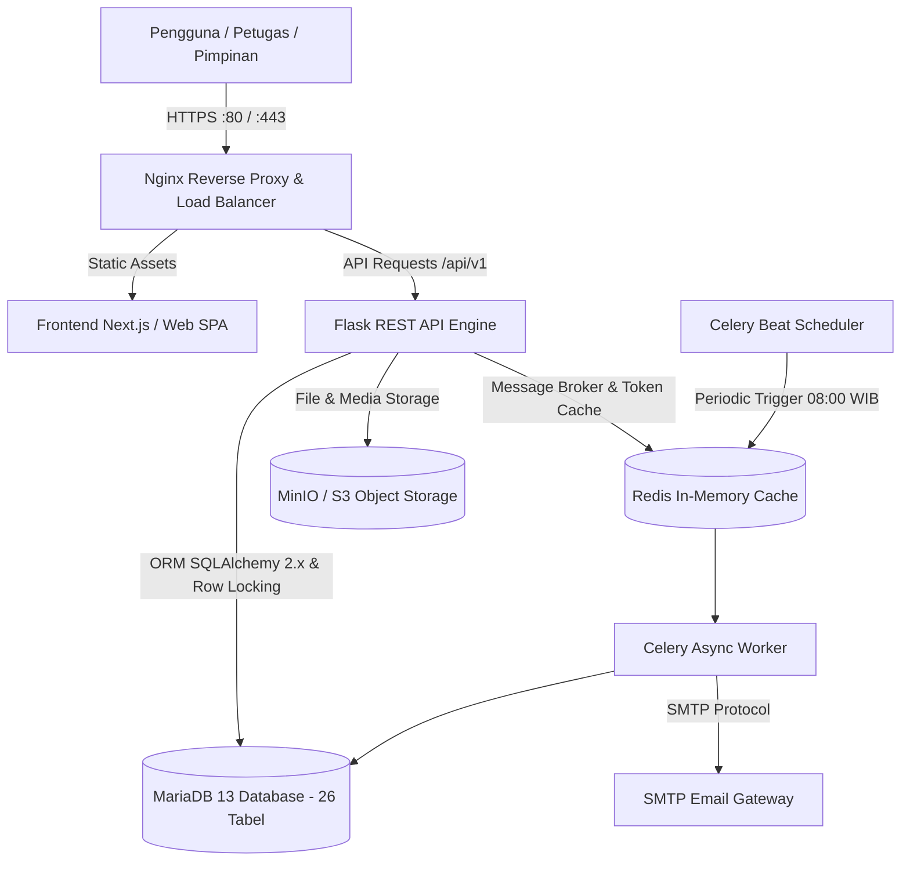

<div align="center">

# 🏛️ SIIPB — SISTEM INFORMASI INVENTARIS, PEMINJAMAN, DAN PENGEMBALIAN BARANG
**Platform Tata Kelola Aset dan Sirkulasi Inventaris Terintegrasi Berstandar Enterprise**

[]()
[]()
[]()
[-brightgreen?style=for-the-badge)]()

</div>

---

## 📑 Daftar Isi
1. [Ringkasan Eksekutif (Executive Summary)](#1-ringkasan-eksekutif-executive-summary)
2. [Tujuan Strategis & Nilai Bisnis](#2-tujuan-strategis--nilai-bisnis)
3. [Arsitektur Sistem Terintegrasi](#3-arsitektur-sistem-terintegrasi)
4. [Fitur Unggulan & Kapabilitas Utama](#4-fitur-unggulan--kapabilitas-utama)
5. [Prinsip Tata Kelola & Integritas Data](#5-prinsip-tata-kelola--integritas-data)
6. [Struktur Repositori (Monorepo Governance)](#6-struktur-repositori-monorepo-governance)
7. [Matriks Kesesuaian Teknologi](#7-matriks-kesesuaian-teknologi)
8. [Kesiapan Pengujian & Jaminan Mutu (QA)](#8-kesiapan-pengujian--jaminan-mutu-qa)
9. [Panduan Deployment & Operasional](#9-panduan-deployment--operasional)
10. [Dokumentasi API & Kontak](#10-dokumentasi-api--kontak)

---

## 1. Ringkasan Eksekutif (Executive Summary)

**SIIPB (Sistem Informasi Inventaris Barang, Peminjaman, dan Pengembalian Barang)** adalah solusi tata kelola aset digital yang dirancang untuk memodernisasi dan mengamankan seluruh siklus pengelolaan barang inventaris di lingkungan organisasi/lembaga.

Sistem ini memusatkan pencatatan aset fisik, mendigitalkan proses peminjaman dan pengembalian, memantau risiko keterlambatan melalui otomasi notifikasi terjadwal, serta mencatat rekam jejak audit (*audit trail*) yang tidak dapat dimanipulasi secara sepihak. Seluruh arsitektur dikembangkan mengacu pada cetak biru resmi **Blueprint Proyek SIIPB** dengan penekanan pada keandalan tinggi, konkurensi data bebas benturan (*race condition*), serta kepatuhan tata kelola TI (*IT Governance*).

---

## 2. Tujuan Strategis & Nilai Bisnis

| Aspek Strategis | Manfaat & Dampak Nyata |
| :--- | :--- |
| **Pencegahan Kehilangan Aset** | Identifikasi real-time status barang (`TERSEDIA`, `DIPINJAM`, `RUSAK`, `HILANG`) dengan histori mutasi lengkap. |
| **Mitigasi Keterlambatan** | Notifikasi pengingat otomatis multi-tahap (H-3, H-1, H, hingga eskalasi H+1, H+3, H+7) langsung ke peminjam dan pimpinan. |
| **Efisiensi Kerja Petugas** | Peminjam tidak dibebani akun/formulir rumit; transaksi diverifikasi cepat oleh petugas Sarpras/IT. |
| **Akuntabilitas & Audit Trail** | Log aktivitas *append-only* mencatat pelaku, waktu, alamat IP, data sebelum, dan data sesudah perubahan. |
| **Pengambilan Keputusan Cepat** | Dashboard analitik terpusat menampilkan ketersediaan aset, transaksi aktif, rasio kerusakan, dan biaya perbaikan. |

---

## 3. Arsitektur Sistem Terintegrasi

Sistem mengadopsi arsitektur *Service-Oriented Monorepo* berbasis standar industri:



---

## 4. Fitur Unggulan & Kapabilitas Utama

### A. Siklus Hidup Aset Terpadu (*Asset Lifecycle Management*)
- **Pencatatan Komprehensif:** Kode inventaris unik, nomor seri pabrikan, kategori, lokasi gedung/ruangan, unit pemilik, serta foto fisik aset.
- **Histori Pergerakan (Timeline):** Rekam jejak kronologis perpindahan lokasi, pergantian status, mutasi penanggung jawab, dan pemeliharaan.
- **Pencatatan Kerusakan & Pemulihan:** Alur perbaikan terstruktur dari pelaporan insiden, estimasi biaya reparasi, perbaikan teknis, hingga pengembalian kondisi siap pakai (`TERSEDIA`).

### B. Sirkulasi Peminjaman Berkeamanan Tinggi
- **Pencegahan Double-Lending (Concurrency Safe):** Transaksi checkout dilindungi mekanisme *Pessimistic Row Locking* (`SELECT ... FOR UPDATE`) pada level basis data, menjamin dua petugas tidak dapat meminjamkan unit barang yang sama secara bersamaan.
- **Peminjam Tanpa Beban Akun:** Peminjam dicatat sebagai entitas master terverifikasi tanpa perlu membuat akun atau login ke sistem, menjaga privasi dan kecepatan pelayanan.
- **Dukungan Pengembalian Parsial:** Peminjam dapat mengembalikan sebagian barang terlebih dahulu dari transaksi gabungan tanpa merusak integritas data transaksi.

### C. Sistem Peringatan Dini & Eskalasi Terjadwal (*Idempotent Notifications*)
- **Jadwal Pengingat Terukur:**
  - `H-3`: Notifikasi persiapan pengembalian.
  - `H-1`: Notifikasi pengingat H-1 batas waktu.
  - `H-0`: Notifikasi batas pengembalian hari ini.
  - `H+1` s/d `H+7`: Penandaan otomatis status `TERLAMBAT` dan eskalasi bertingkat ke Pimpinan Unit & Kasubag Sarpras.
- **Jaminan Idempoten:** Mencegah pengiriman email berulang kali (*anti-spam*) untuk satu kejadian yang sama.

### D. Keamanan Tingkat Enterprise (*Enterprise Security & RBAC*)
- **Hierarki Peran (RBAC):** Administrator, Petugas Sarpras/IT, dan Pimpinan dengan izin per-modul (`asset.create`, `borrowing.checkout`, `damage.manage`, `audit.read`).
- **Tokenisasi JWT & Keamanan Refresh:** JWT Access Token berumur pendek dengan Refresh Token yang disimpan dalam bentuk hash SHA-256 (bukan plaintext).
- **Single Sign-On (SSO):** Integrasi Google Workspace / OAuth 2.0 / OIDC melalui Authlib.

---

## 5. Prinsip Tata Kelola & Integritas Data

1. **Non-Destructive History:** Tidak ada riwayat transaksi peminjaman atau pengembalian yang dihapus (`ON DELETE RESTRICT`). Integritas pembukuan organisasi terjaga seumur hidup sistem.
2. **Strict State Transitions:** Status ketersediaan barang diikat dengan *CHECK Constraint* basis data untuk mencegah inkonsistensi data.
3. **Audit Trail Lengkap:** Seluruh aksi kritis (tambah/ubah barang, approval checkout, penerimaan kondisi rusak, update perbaikan) dicatat ke tabel `audit_logs`.

---

## 6. Struktur Repositori (Monorepo Governance)

```text
SIIPB/
├── backend/                      # 🐍 REST API Service, Business Logic, & Celery Worker
│   ├── app/
│   │   ├── middleware/           # Proteksi endpoint & RBAC authorization
│   │   ├── models/               # Pemetaan 26 tabel database (SQLAlchemy 2.x)
│   │   ├── routes/               # Modular REST Blueprints (/api/v1/...)
│   │   ├── schemas/              # Validasi payload request (Marshmallow)
│   │   ├── services/             # Core business rules & row-locking transactions
│   │   ├── tasks/                # Celery background email worker & beat scheduler
│   │   └── utils/                # Security hashing & standard response formatters
│   ├── tests/                    # Pengujian terotomatisasi pytest (16 test cases)
│   ├── Dockerfile                # Kontainerisasi produksi (Gunicorn WSGI)
│   ├── celery_app.py             # Entrypoint task queue & beat crontab
│   └── run.py                    # Server runner
│
├── frontend/                     # ⚛️ Portal Antarmuka Web (Next.js + TypeScript)
│   └── README.md                 # Panduan implementasi UI
│
├── database/                     # 🗄️ Database Master & Migrasi
│   ├── SIIPB.sql                 # DDL 26 tabel MariaDB 13 siap produksi
│   └── README.md                 # Dokumentasi skema dan kamus data
│
├── infrastructure/               # 🌐 Konfigurasi Jaringan & Web Server
│   └── nginx/nginx.conf          # Reverse proxy, caching, compression & rate limit
│
├── docs/                         # 📚 Arsip Dokumentasi & Spesifikasi
│   ├── api_specification.md      # Kontrak API Frontend <-> Backend
│   └── architecture.md           # Desain teknis sistem
│
├── docker-compose.yml            # Orkestrasi multi-kontainer satu klik
└── README.md                     # Dokumentasi eksekutif proyek
```

---

## 7. Matriks Kesesuaian Teknologi

| Komponen Arsitektur | Teknologi Terpilih | Justifikasi Teknis |
| :--- | :--- | :--- |
| **Backend Framework** | **Python 3.12 + Flask** | Ringan, modular, berperforma tinggi, dan minim *overhead*. |
| **Database Engine** | **MariaDB 13 (InnoDB)** | Kepatuhan ACID penuh, row locking cepat, dan integritas foreign key ketat. |
| **Database ORM** | **SQLAlchemy 2.0** | Standar modern Python ORM dengan tipe data deklaratif dan kontrol transaksi presisi. |
| **Skema Migrasi** | **Alembic** | Version-controlled database migration tanpa risiko data corrupt. |
| **Asynchronous Queue** | **Celery + Redis** | Memisahkan pengiriman email dan pekerjaan berat agar respons API instan (<50ms). |
| **Otomasi Scheduler** | **Celery Beat** | Pemantauan berkala independen tanpa memerlukan cron job OS manual. |
| **Dokumentasi API** | **OpenAPI / Swagger** | Dokumentasi interaktif otomatis dan siap uji bagi tim pengembang. |
| **Reverse Proxy** | **Nginx 1.25** | Kompresi Gzip, proteksi serangan, dan terminasi proxy terpusat. |
| **Kontainerisasi** | **Docker & Compose** | Lingkungan replikatif, mudah dipindahkan antar-server, dan siap scale-out. |

---

## 8. Kesiapan Pengujian & Jaminan Mutu (QA)

Sistem telah diuji secara menyeluruh menggunakan automated testing suite dengan **kelulusan 100%**:

```text
============================= test session starts =============================
platform win32 -- Python 3.12.10, pytest-9.1.1
rootdir: C:\SIIPB\backend

tests/test_assets.py::test_list_assets PASSED                            [  6%]
tests/test_assets.py::test_create_and_get_asset PASSED                   [ 12%]
tests/test_assets.py::test_create_asset_duplicate_code PASSED            [ 18%]
tests/test_auth.py::test_health_check PASSED                             [ 25%]
tests/test_auth.py::test_login_success PASSED                            [ 31%]
tests/test_auth.py::test_login_invalid_password PASSED                   [ 37%]
tests/test_auth.py::test_get_me_profile PASSED                           [ 43%]
tests/test_auth.py::test_refresh_token PASSED                            [ 50%]
tests/test_borrowing.py::test_checkout_borrowing_workflow PASSED         [ 56%]
tests/test_borrowing.py::test_checkout_invalid_dates PASSED              [ 62%]
tests/test_concurrent_checkout.py::test_concurrent_checkout_prevents_double_lending PASSED [ 68%]
tests/test_master.py::test_master_endpoints PASSED                       [ 75%]
tests/test_master.py::test_create_and_manage_borrower PASSED             [ 81%]
tests/test_master.py::test_dashboard_summary PASSED                      [ 87%]
tests/test_returns.py::test_return_condition_baik PASSED                 [ 93%]
tests/test_returns.py::test_return_condition_rusak_and_repair_lifecycle PASSED [100%]

============================= 16 passed in 0.65s ==============================
```

> **Catatan Penting Pengujian Konkurensi:**
> Tes `test_concurrent_checkout.py` mensimulasikan dua thread simultan yang mengeksekusi checkout pada satu aset di milidetik yang sama. Hasil pengujian membuktikan transaksi pertama berhasil dicatat, dan transaksi kedua ditolak secara aman karena unit telah terkunci (`DIPINJAM`), membuktikan kekebalan sistem dari anomali data ganda.

---

## 9. Panduan Deployment & Operasional

### A. Deployment Satu Perintah (Docker Compose)
Seluruh ekosistem (MariaDB, Redis, Backend API, Celery Worker, Celery Beat, dan Nginx) dapat dijalankan serentak:

```bash
docker compose up -d --build
```
Layanan akan beroperasi di port:
- **Web Service & Reverse Proxy:** `http://<IP-SERVER>:80`
- **Swagger API Docs:** `http://<IP-SERVER>:80/api/docs`
- **Health Check:** `http://<IP-SERVER>:80/api/health`

### B. Menjalankan Manual di Lingkungan Pengembang
```bash
# 1. Masuk ke direktori backend & aktifkan environment
cd backend
python -m venv .venv
.\.venv\Scripts\activate       # Windows (atau 'source .venv/bin/activate' di Linux)
pip install -r requirements.txt

# 2. Jalankan Server API
python run.py

# 3. Jalankan Background Worker (Terminal Terpisah)
celery -A celery_app.celery worker --loglevel=info
celery -A celery_app.celery beat --loglevel=info
```

---

## 10. Dokumentasi API & Kontak

- **Spesifikasi Lengkap REST API:** Kunjungi endpoint `/api/docs` saat server aktif untuk melihat antarmuka Swagger UI interaktif yang memuat seluruh parameter, model payload, dan skema respons.
- **Repository Git:** [GitHub lemonade199/SIIPB](https://github.com/lemonade199/SIIPB.git) (Branch `main`).

---

<div align="center">
  <small>© 2026 Tim Pengembang SIIPB — Seluruh hak cipta dilindungi undang-undang.</small>
</div>