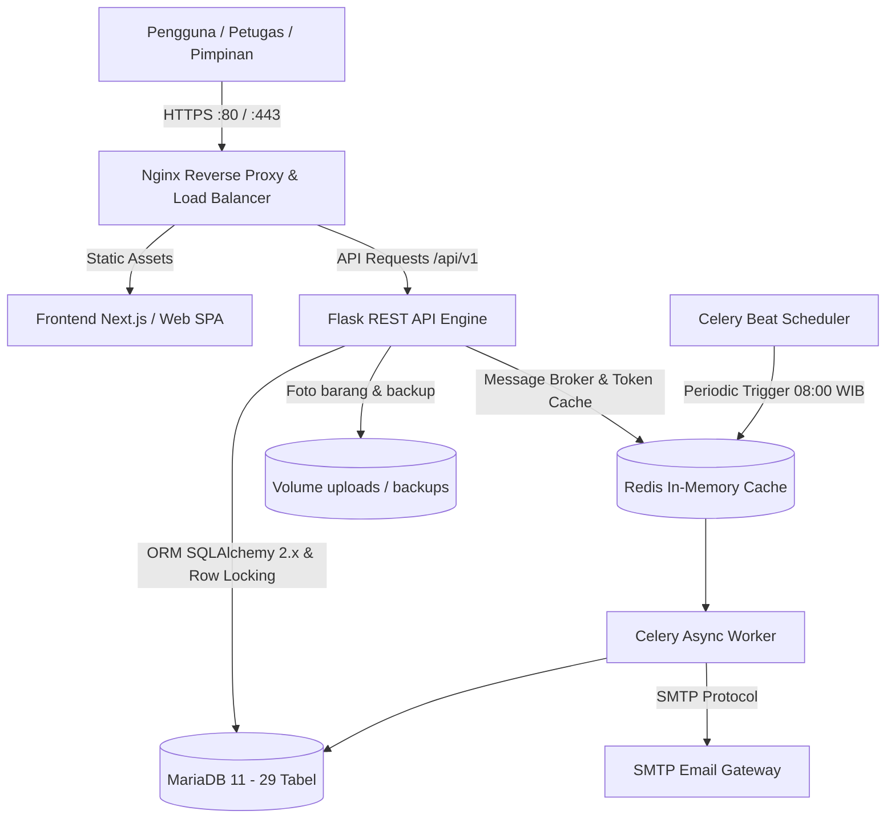

<div align="center">

# 🏛️ SIIPB — SISTEM INFORMASI INVENTARIS, PEMINJAMAN, DAN PENGEMBALIAN BARANG
**Platform Tata Kelola Aset dan Sirkulasi Inventaris Terintegrasi Berstandar Enterprise**

[]()
[]()
[]()
[-brightgreen?style=for-the-badge)]()

</div>

---

## 📑 Daftar Isi
1. [Ringkasan Eksekutif (Executive Summary)](#1-ringkasan-eksekutif-executive-summary)
2. [Tujuan Strategis & Nilai Bisnis](#2-tujuan-strategis--nilai-bisnis)
3. [Arsitektur Sistem Terintegrasi](#3-arsitektur-sistem-terintegrasi)
4. [Fitur Unggulan & Kapabilitas Utama](#4-fitur-unggulan--kapabilitas-utama)
5. [Prinsip Tata Kelola & Integritas Data](#5-prinsip-tata-kelola--integritas-data)
6. [Struktur Repositori (Monorepo Governance)](#6-struktur-repositori-monorepo-governance)
7. [Matriks Kesesuaian Teknologi](#7-matriks-kesesuaian-teknologi)
8. [Kesiapan Pengujian & Jaminan Mutu (QA)](#8-kesiapan-pengujian--jaminan-mutu-qa)
 9. [Panduan Deployment & Operasional](#9-panduan-deployment--operasional)
10. [Kredensial & Akun Bawaan (Default Accounts)](#10-kredensial--akun-bawaan-default-accounts)
11. [Dokumentasi API & Kontak](#11-dokumentasi-api--kontak)

---

## 1. Ringkasan Eksekutif (Executive Summary)

**SIIPB (Sistem Informasi Inventaris Barang, Peminjaman, dan Pengembalian Barang)** adalah solusi tata kelola aset digital yang dirancang untuk memodernisasi dan mengamankan seluruh siklus pengelolaan barang inventaris di lingkungan organisasi/lembaga.

Sistem ini memusatkan pencatatan aset fisik, mendigitalkan proses peminjaman dan pengembalian, memantau risiko keterlambatan melalui otomasi notifikasi terjadwal, serta mencatat rekam jejak audit (*audit trail*) yang tidak dapat dimanipulasi secara sepihak. Seluruh arsitektur dikembangkan mengacu pada cetak biru resmi **Blueprint Proyek SIIPB** dengan penekanan pada keandalan tinggi, konkurensi data bebas benturan (*race condition*), serta kepatuhan tata kelola TI (*IT Governance*).

---

## 2. Tujuan Strategis & Nilai Bisnis

| Aspek Strategis | Manfaat & Dampak Nyata |
| :--- | :--- |
| **Pencegahan Kehilangan Aset** | Identifikasi real-time status barang (`TERSEDIA`, `DIPINJAM`, `RUSAK`, `HILANG`) dengan histori mutasi lengkap. |
| **Mitigasi Keterlambatan** | Notifikasi pengingat otomatis multi-tahap (H-3, H-1, H, hingga eskalasi H+1, H+3, H+7) langsung ke peminjam dan pimpinan. |
| **Efisiensi Kerja Petugas** | Peminjam tidak dibebani akun/formulir rumit; transaksi diverifikasi cepat oleh petugas Sarpras/IT. |
| **Akuntabilitas & Audit Trail** | Log aktivitas *append-only* mencatat pelaku, waktu, alamat IP, data sebelum, dan data sesudah perubahan. |
| **Pengambilan Keputusan Cepat** | Dashboard analitik terpusat menampilkan ketersediaan aset, transaksi aktif, rasio kerusakan, dan biaya perbaikan. |

---

## 3. Arsitektur Sistem Terintegrasi

Sistem mengadopsi arsitektur *Service-Oriented Monorepo* berbasis standar industri:



---

## 4. Fitur Unggulan & Kapabilitas Utama

### A. Siklus Hidup Aset Terpadu (*Asset Lifecycle Management*)
- **Pencatatan Komprehensif:** Kode inventaris unik, nomor seri pabrikan, kategori, lokasi gedung/ruangan, unit pemilik, serta foto fisik aset.
- **Histori Pergerakan (Timeline):** Rekam jejak kronologis perpindahan lokasi, pergantian status, mutasi penanggung jawab, dan pemeliharaan.
- **Pencatatan Kerusakan & Pemulihan:** Alur perbaikan terstruktur dari pelaporan insiden, estimasi biaya reparasi, perbaikan teknis, hingga pengembalian kondisi siap pakai (`TERSEDIA`).

### B. Sirkulasi Peminjaman Berkeamanan Tinggi
- **Pencegahan Double-Lending (Concurrency Safe):** Transaksi checkout dilindungi mekanisme *Pessimistic Row Locking* (`SELECT ... FOR UPDATE`) pada level basis data, menjamin dua petugas tidak dapat meminjamkan unit barang yang sama secara bersamaan.
- **Peminjam Tanpa Beban Akun:** Peminjam dicatat sebagai entitas master terverifikasi tanpa perlu membuat akun atau login ke sistem, menjaga privasi dan kecepatan pelayanan.
- **Dukungan Pengembalian Parsial:** Peminjam dapat mengembalikan sebagian barang terlebih dahulu dari transaksi gabungan tanpa merusak integritas data transaksi.

### C. Sistem Peringatan Dini & Eskalasi Terjadwal (*Idempotent Notifications*)
- **Jadwal Pengingat Terukur:**
  - `H-3`: Notifikasi persiapan pengembalian.
  - `H-1`: Notifikasi pengingat H-1 batas waktu.
  - `H-0`: Notifikasi batas pengembalian hari ini.
  - `H+1` s/d `H+7`: Penandaan otomatis status `TERLAMBAT` dan eskalasi bertingkat ke Pimpinan Unit & Kasubag Sarpras.
- **Jaminan Idempoten:** Mencegah pengiriman email berulang kali (*anti-spam*) untuk satu kejadian yang sama.

### D. Keamanan Tingkat Enterprise (*Enterprise Security & RBAC*)
- **Hierarki Peran (RBAC):** Administrator, Petugas Sarpras/IT, dan Pimpinan dengan izin per-modul (`asset.create`, `borrowing.checkout`, `damage.manage`, `audit.read`).
- **Tokenisasi JWT & Keamanan Refresh:** JWT Access Token berumur pendek dengan Refresh Token yang disimpan dalam bentuk hash SHA-256 (bukan plaintext).
- **Single Sign-On (SSO):** Integrasi Google Workspace / OAuth 2.0 / OIDC melalui Authlib.

---

## 5. Prinsip Tata Kelola & Integritas Data

1. **Non-Destructive History:** Tidak ada riwayat transaksi peminjaman atau pengembalian yang dihapus (`ON DELETE RESTRICT`). Integritas pembukuan organisasi terjaga seumur hidup sistem.
2. **Strict State Transitions:** Status ketersediaan barang diikat dengan *CHECK Constraint* basis data untuk mencegah inkonsistensi data.
3. **Audit Trail Lengkap:** Seluruh aksi kritis (tambah/ubah barang, approval checkout, penerimaan kondisi rusak, update perbaikan) dicatat ke tabel `audit_logs`.

---

## 6. Struktur Repositori (Monorepo Governance)

```text
SIIPB/
├── backend/                      # 🐍 Flask REST API, aturan bisnis, Celery worker & beat
│   ├── app/
│   │   ├── middleware/           # JWT + RBAC (izin dibaca ulang dari DB setiap permintaan)
│   │   ├── models/               # 29 tabel (SQLAlchemy 2.x)
│   │   ├── routes/               # Blueprint /api/v1/... (Swagger di /api/docs)
│   │   ├── schemas/              # Validasi payload (Marshmallow)
│   │   ├── services/             # Aturan bisnis, row locking, notifikasi, laporan, backup
│   │   ├── tasks/                # Celery: email SMTP (retry), pemeriksaan jatuh tempo, backup
│   │   └── utils/                # Keamanan (scrypt, JWT) & format respons
│   ├── alembic/versions/         # Migrasi skema (f627… awal, a7c3… fitur Plan)
│   ├── scripts/seed_data.py      # Seed idempoten (role, permission, template, akun awal)
│   ├── tests/                    # pytest — database uji terpisah (siipb_test)
│   ├── Dockerfile                # Gunicorn + WeasyPrint + mariadb-client
│   └── docker-entrypoint.sh      # alembic upgrade head + seed sebelum start
│
├── frontend/                     # ⚛️ Next.js 16 + React 19 + TypeScript + Tailwind + shadcn/ui
│   ├── app/ components/ lib/ services/ hooks/ types/
│   ├── tests/                    # Vitest (unit) & Playwright (UI mock + integrasi API)
│   └── Dockerfile                # build standalone
│
├── database/SIIPB.sql            # Referensi skema terbaru (hasil alembic upgrade head)
├── infrastructure/
│   ├── nginx/nginx.conf          # / → Next.js, /api → Flask, /uploads → volume, rate limit login
│   ├── nginx/nginx.https.conf    # Varian HTTPS (HSTS, TLS 1.2/1.3)
│   └── scripts/                  # backup_db.sh & restore_db.sh
├── docs/                         # Spesifikasi API & arsitektur
├── .github/workflows/ci.yml      # CI: pytest, lint/typecheck/vitest/build, Playwright, docker build
├── docker-compose.yml            # Nginx, Next.js, Flask, MariaDB, Redis, Celery worker & beat
└── .env.example                  # Contoh konfigurasi (rahasia tidak di-commit)
```

---

## 7. Matriks Kesesuaian Teknologi (dokumen Plan §8)

| Komponen | Teknologi | Status |
| :--- | :--- | :--- |
| Frontend | Next.js + React + TypeScript, Tailwind CSS + shadcn/ui | ✅ `frontend/` |
| Backend & API | Python 3.12 + Flask, REST + JSON | ✅ `backend/app/routes` |
| Dokumentasi API | OpenAPI / Swagger (flasgger) | ✅ `/api/docs` |
| Database & ORM | MariaDB 11.x + SQLAlchemy 2.x, migrasi Alembic | ✅ |
| Autentikasi & SSO | JWT (access + refresh, rotasi saat ganti sandi), OAuth 2.0/OIDC (Authlib, state/nonce) | ✅ |
| Otorisasi | RBAC 16 permission, role dapat diatur dari UI | ✅ |
| Queue / Worker / Scheduler | Redis + Celery + Celery Beat | ✅ |
| Email | SMTP (STARTTLS/SSL), kata sandi tersimpan terenkripsi | ✅ |
| QR Code | Python `qrcode` (`/assets/{id}/qr`) + pemindai di UI | ✅ |
| PDF / Excel | WeasyPrint / openpyxl (`/reports/{jenis}?format=pdf|xlsx`) | ✅ |
| Pengujian | pytest, Vitest, Playwright | ✅ |
| Web server & container | Nginx + Docker Compose | ✅ |
| CI/CD | GitHub Actions | ✅ `.github/workflows/ci.yml` |
| Penyimpanan berkas | Volume lokal `/app/uploads` (MinIO/S3 opsional — konfigurasi `S3_*`) | ⚠️ lokal |

---

## 8. Kesiapan Pengujian & Jaminan Mutu (QA)

| Jenis (Plan §22) | Cakupan | Perintah |
| :--- | :--- | :--- |
| Unit & API test (backend) | 62 tes: auth/JWT/refresh/SSO code, RBAC per role, CRUD master, inventaris (foto, QR, status manual, alias `/items`), draf→checkout, pengembalian rusak/hilang, **notifikasi H-3…H+7 + eskalasi + anti-duplikat**, laporan PDF/Excel, pengaturan SMTP terenkripsi, audit log, backup | `cd backend && pytest` |
| Concurrency test | 4 checkout bersamaan pada barang yang sama → tepat 1 berhasil (`SELECT … FOR UPDATE`) | termasuk di atas |
| Unit test frontend | 41 tes: tanggal, aturan bisnis, mapper API, komponen | `cd frontend && npm test` |
| UI test (mode mock) | 7 skenario Playwright | `npm run test:e2e` |
| Integrasi frontend ↔ API | 4 skenario Playwright (foto, draf/checkout/pengembalian, pengguna, pengaturan, scheduler, laporan, RBAC) — lulus langsung & lewat Nginx | `E2E_API=1 npx playwright test tests/e2e/api.spec.ts` |

Database uji dibuat ulang otomatis (`siipb_test`: DROP → `alembic upgrade head` → seed), sehingga database pengembangan tidak tersentuh.

---

## 9. Panduan Deployment & Operasional

### A. Docker Compose (production)
```bash
cp .env.example .env        # ganti semua nilai "ganti-…" (DB, SECRET_KEY, JWT_SECRET_KEY, SEED_ADMIN_PASSWORD)
docker compose up -d --build
```
- Aplikasi: `http://<server>` (HTTPS: `NGINX_CONF=nginx.https.conf` + sertifikat di `infrastructure/nginx/certs/`)
- Swagger: `/api/docs` · Health check: `/api/health`
- Container `backend` menjalankan `alembic upgrade head` + seed (akun `admin` dengan `SEED_ADMIN_PASSWORD`) sebelum start.
- Backup: otomatis tiap hari 01.00 (Celery Beat, volume `backups_data`), manual dari **Pengaturan → Backup**, atau `infrastructure/scripts/backup_db.sh`. Pemulihan: `infrastructure/scripts/restore_db.sh <berkas>`.
- Rollback: `docker compose down` → checkout tag sebelumnya → `alembic downgrade <revisi>` bila perlu → `docker compose up -d --build`.

### B. Pengembangan lokal
```bash
# Backend (MariaDB & Redis berjalan lokal)
cd backend && python -m venv .venv && source .venv/bin/activate   # Windows: .venv\Scripts\activate
pip install -r requirements.txt
alembic upgrade head && python scripts/seed_data.py               # admin/admin123, petugas/petugas123, pimpinan/pimpinan123
python run.py                                                     # http://localhost:5000/api/docs
celery -A celery_app.celery worker --loglevel=info                # opsional (tanpa worker: NOTIFICATION_DISPATCH=sync)
celery -A celery_app.celery beat --loglevel=info

# Frontend
cd frontend && npm install
cp .env.example .env    # NEXT_PUBLIC_DATA_SOURCE=api, NEXT_PUBLIC_API_BASE_URL=http://localhost:5000/api/v1
npm run dev             # http://localhost:3000  (tanpa backend: NEXT_PUBLIC_DATA_SOURCE=mock)
```

---

## 10. Kredensial & Akun Bawaan (Default Accounts)

Setelah menjalankan `python scripts/seed_data.py` (pada mode API/Database) atau saat menjalankan frontend pada mode Mock (`NEXT_PUBLIC_DATA_SOURCE=mock`), akun-akun bawaan berikut siap digunakan untuk login:

| Peran (Role) | Username | Email | Password Default | Hak Akses Utama |
| :--- | :--- | :--- | :--- | :--- |
| **Administrator** | `admin` | `admin@siipb.local` | `admin123` | Akses penuh sistem, manajemen pengguna, role & permission, pengaturan SMTP/sistem, audit log, dan backup. |
| **Petugas Sarpras / IT** | `petugas` | `petugas@siipb.local` | `petugas123` | Manajemen aset/inventaris, pencatatan transaksi peminjaman & pengembalian, monitoring keterlambatan, cetak label QR, dan ekspor laporan. |
| **Pimpinan** | `pimpinan` | `pimpinan@siipb.local` | `pimpinan123` | Monitoring dashboard eksekutif, rekapitulasi keterlambatan/eskalasi, dan melihat/ekspor laporan aset & sirkulasi. |

> [!IMPORTANT]
> **Catatan Keamanan Production:**
> - Kata sandi default di atas dapat disesuaikan sebelum inisialisasi melalui environment variable `SEED_ADMIN_PASSWORD`, `SEED_PETUGAS_PASSWORD`, dan `SEED_PIMPINAN_PASSWORD`.
> - Untuk lingkungan *production*, sangat disarankan untuk segera mengganti kata sandi bawaan melalui menu **Pengaturan Pengguna** setelah login pertama kali.

---

## 11. Dokumentasi API & Kontak

- **Spesifikasi Lengkap REST API:** Kunjungi endpoint `/api/docs` saat server aktif untuk melihat antarmuka Swagger UI interaktif yang memuat seluruh parameter, model payload, dan skema respons.
- **Daftar endpoint:** [`docs/api_specification.md`](docs/api_specification.md).
- **Repository Git:** [GitHub lemonade199/SIIPB](https://github.com/lemonade199/SIIPB.git).

---

<div align="center">
  <small>© 2026 Tim Pengembang SIIPB — Seluruh hak cipta dilindungi undang-undang.</small>
</div>